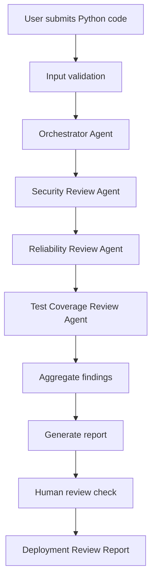

# TrustLayer AI Project Documentation

## Project Overview

TrustLayer AI is a multi-agent code review application designed to help teams
review Python code before deployment. The idea behind the project is simple:
AI can generate code quickly, but generated code still needs a structured safety
check before it reaches production.

The app reviews source code across three practical areas:

- Security
- Reliability
- Test coverage

It then combines the findings into a deployment-focused report with an overall
risk score and a human-review decision.

## Why This Project Matters

As AI-generated code becomes more common, teams need a way to slow down at the
right moment. Fast code generation is useful, but speed can also make it easier
to miss hardcoded secrets, unsafe database queries, missing retries, weak error
handling, or incomplete test coverage.

TrustLayer AI acts as a safety layer between code creation and deployment. It
does not replace developers or code reviewers. Instead, it gives teams a
repeatable review process that helps answer one important question:

```text
Is this code safe enough to move forward, or does it need human review first?
```

## Product Goal

The goal of TrustLayer AI is to provide a clear pre-deployment review experience
for Python code. A user can upload a `.py` file or paste source code, run the
review, and receive a structured report that highlights the most important risks.

The app is intentionally focused. It follows the MINT principle:

```text
Minimal Intelligence Necessary Tools
```

That means the project uses only the agents needed to solve the core problem:

- Security Review Agent
- Reliability Review Agent
- Test Coverage Review Agent
- Orchestrator Agent

No extra agents were added just for complexity.

## User Experience

The user flow is designed to feel like a lightweight deployment review console.

1. The user submits Python code by uploading a `.py` file or pasting code.
2. The app validates the input before running any agents.
3. The user clicks **Run Review**.
4. The app shows the agent execution summary.
5. Each agent reviews the code from its own perspective.
6. The orchestrator aggregates the findings.
7. The final report displays risk, findings, human-review status, and next steps.

The main output is the **Deployment Review Report**, which includes:

- Executive summary
- Overall risk score
- Findings table
- Human review status
- Recommended next steps
- Audit trace for state visibility

## Architecture

TrustLayer AI uses Streamlit for the interface and LangGraph for workflow
orchestration. Pydantic models define the review state and finding structure.
Each agent contributes findings to the shared state, and the orchestrator is
responsible for moving the workflow forward.



## Agent Responsibilities

### Security Review Agent

The Security Review Agent looks for risks that could expose the application or
its users. It checks for hardcoded secrets, API key exposure, unsafe file
handling, SQL injection risks, authentication concerns, and sensitive data
exposure.

Example findings might include:

- A hardcoded API key
- Dynamic SQL query construction
- Use of `eval` or `exec`
- Sensitive values printed to logs

### Reliability Review Agent

The Reliability Review Agent focuses on whether the code behaves safely and
predictably in production. It checks for missing error handling, missing retries,
missing fallbacks, empty input handling, file validation, database validation,
null handling, and predictable behavior.

Example findings might include:

- External requests without timeouts
- Missing retry logic
- Broad exception handling
- File handling without validation
- JSON parsing without error handling

### Test Coverage Review Agent

The Test Coverage Review Agent reviews whether the code has enough test support
to be trusted. It recommends unit tests, integration tests, edge case tests,
negative tests, user acceptance testing, accessibility testing, and browser
compatibility testing where relevant.

Example findings might include:

- Application logic without visible unit tests
- External integrations without integration tests
- Missing negative test scenarios
- UI code without accessibility or browser compatibility checks

### Orchestrator Agent

The Orchestrator Agent manages the workflow. It receives the validated code,
runs each review agent, tracks completed agents, aggregates findings, calculates
the overall risk score, and determines whether human review is required.

## State Management

The app uses a Pydantic `ReviewState` model to keep the workflow structured and
predictable. This state is passed through the LangGraph workflow.

The main state fields are:

- `file_name`
- `source_code`
- `completed_agents`
- `findings`
- `overall_risk_score`
- `human_review_required`
- `execution_status`
- `timestamps`

Each finding is also structured with:

- Agent
- Severity
- Finding
- Recommendation
- Optional line reference

This makes the final report easier to display, test, and debug.

## Human-in-the-Loop Decision

TrustLayer AI includes a simple human-in-the-loop rule:

```text
If any finding is Critical, human_review_required = True.
```

This is intentionally simple and transparent. The app does not try to manage
approvals inside the product. Instead, it flags when a human reviewer should be
involved before deployment.

For the current version, that is enough. In a larger enterprise version, this
could connect to GitHub pull request approvals, Slack, Jira, or deployment gates.

## Risk Scoring

The risk score is designed to be explainable:

- Any Critical finding produces a Critical score.
- Any High finding produces a High score.
- Three or more Medium findings produce a High score.
- Any Medium finding produces a Medium score.
- Only Low findings, or no findings, produce a Low score.

This keeps the review easy to understand during a demo and avoids hidden scoring
logic.

## Reliability and Error Handling

The app includes several reliability features:

- Empty code validation
- Unsupported file type validation
- File size limits
- Binary content checks
- Agent retry logic
- Graceful fallback when an agent fails
- Logging
- A hidden audit trace for debugging

The app also works without an OpenAI API key. In that case, deterministic checks
still run, which makes the demo more reliable and easier to test locally.

## Demo Walkthrough

For a demo, the best sample file is:

```text
sample_files/vulnerable_app.py
```

Expected result:

- Overall risk: Critical
- Deployment status: Blocked
- Human review: Required
- Security findings should include hardcoded secret detection and dynamic code
  execution
- Reliability findings should include missing timeout and validation concerns
- Test coverage findings should recommend unit and integration tests

A simple demo script:

```text
AI-generated code can move quickly, but teams still need to know whether that
code is secure, reliable, and testable before deployment. TrustLayer AI provides
a structured pre-deployment review. It uses focused agents for security,
reliability, and test coverage, then produces a risk report and flags whether
human review is required.
```

## Design Choices

The project intentionally avoids unnecessary complexity. It does not include
authentication, databases, GitHub pull request integration, multi-file repo
scanning, or approval workflows yet.

Those would be useful future features, but they are not needed to demonstrate
the core idea. The current version focuses on doing one thing clearly:

```text
Review Python code before deployment and flag production-readiness risks.
```

## Future Improvements

Possible future improvements include:

- GitHub pull request integration
- Multi-file repository scanning
- Support for notebooks or JavaScript/TypeScript
- Exportable PDF reports
- Team approval workflows
- Persistent audit history
- Organization-specific review policies

These should be added only after the core workflow is stable and useful.

## Conclusion

TrustLayer AI demonstrates how agentic systems can be useful without becoming
overcomplicated. By using a small number of focused agents, structured state, and
a clear human-review rule, the app gives teams a practical way to review
AI-generated or human-written Python code before deployment.

