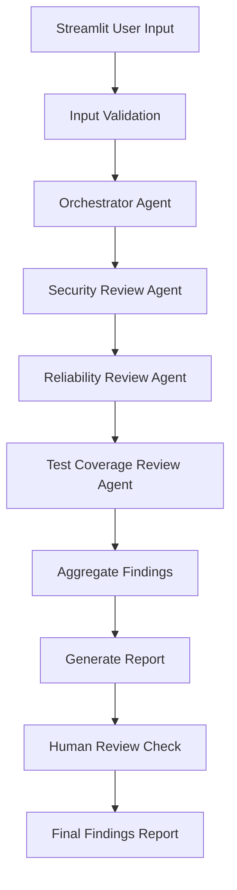
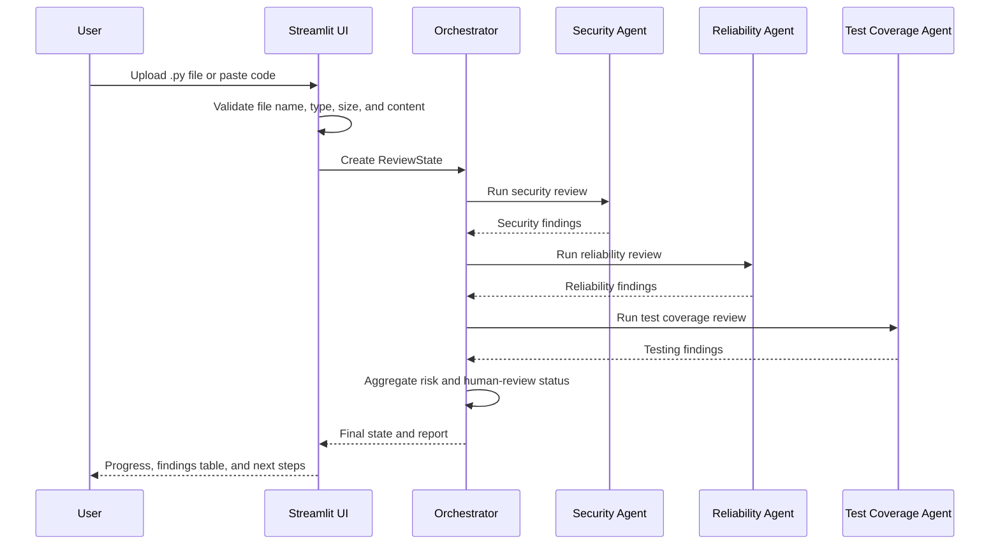

# TrustLayer AI

TrustLayer AI is a production-minded, multi-agent code review app for Python
source code. It evaluates code before deployment for security, reliability, and
test coverage concerns, then generates a prioritized review report with a
human-in-the-loop escalation when Critical issues are found.

The app follows the MINT framework: Minimal Intelligence Necessary Tools. It
uses only three specialist agents plus one orchestrator.

## What It Does

- Accepts a Python `.py` file upload or pasted Python source code.
- Validates input before review.
- Runs a LangGraph workflow with:
  - Security Review Agent
  - Reliability Review Agent
  - Test Coverage Review Agent
  - Orchestrator Agent
- Produces an executive summary, risk score, findings table, human-review
  decision, and recommended next steps.
- Uses deterministic checks as a fallback when `OPENAI_API_KEY` is not set.

## Tech Stack

- **Python** - core application language
- **Streamlit** - interactive web UI
- **LangGraph** - agent workflow orchestration
- **LangChain** - LLM integration layer
- **OpenAI** - optional LLM-powered review
- **Pydantic** - structured state and finding models
- **Pandas** - findings table display
- **Pytest** - validation and workflow tests

## Architecture



## Agent Workflow



## Project Structure

```text
trustlayer-ai/
  app/
    agents/
      base.py
      security_agent.py
      reliability_agent.py
      testing_agent.py
    graph/
      workflow.py
    models/
      state.py
    ui/
      streamlit_app.py
    utils/
      config.py
      logging_config.py
      prompts.py
      risk.py
      validation.py
  sample_files/
    vulnerable_app.py
    reliable_app.py
    missing_tests_example.py
  example_outputs/
    sample_review_report.md
  README.md
  requirements.txt
  .env.example
```

## Agent Responsibilities

### Security Review Agent

Checks for hardcoded secrets, API key exposure, unsafe file uploads, SQL
injection risks, authentication concerns, and sensitive data exposure.

### Reliability Review Agent

Checks for missing error handling, retries, fallbacks, null handling, empty input
handling, data validation, file validation, database validation, and
predictability concerns.

### Test Coverage Review Agent

Checks for missing unit tests, integration tests, edge case tests, negative test
scenarios, accessibility testing, browser compatibility testing, and user
acceptance testing recommendations.

### Orchestrator Agent

Maintains workflow state, executes agents, aggregates findings, generates the
final report, and triggers human review when needed.

## State Management

`app/models/state.py` defines the Pydantic workflow state. The state is passed
through every LangGraph node so each agent reads the same source code and appends
structured findings.

- `file_name`
- `source_code`
- `completed_agents`
- `findings`
- `overall_risk_score`
- `human_review_required`
- `execution_status`
- `timestamps`

The app also keeps a generated report and recoverable agent errors in state so
the UI can display graceful fallback information during demos.

Each finding contains:

- `Agent`
- `Severity`
- `Finding`
- `Recommendation`
- optional `line_reference`

## Setup

Create and activate a virtual environment:

```bash
python3 -m venv .venv
source .venv/bin/activate
```

Install dependencies:

```bash
pip install -r requirements.txt
```

Optional: configure OpenAI for deeper LLM review:

```bash
cp .env.example .env
```

Then add your key:

```text
OPENAI_API_KEY=
```

The app still runs without an API key using deterministic review checks.

## Run Locally

```bash
python3 -m streamlit run app/ui/streamlit_app.py
```

Open the local URL printed by Streamlit.

## Try the Samples

Upload one of these files:

- `sample_files/vulnerable_app.py`
- `sample_files/reliable_app.py`
- `sample_files/missing_tests_example.py`

An example report is included at:

```text
example_outputs/sample_review_report.md
```

## Streamlit Community Cloud Deployment

1. Push this repository to GitHub.
2. In Streamlit Community Cloud, create a new app from the repository.
3. Set the main file path to:

```text
app/ui/streamlit_app.py
```

4. Add `OPENAI_API_KEY` in Streamlit secrets if you want LLM-backed review.
5. Deploy.

## Human-in-the-Loop Rule

If any finding has severity `Critical`, TrustLayer AI sets:

```text
human_review_required = True
```

The UI and final report display a Human Review Status section explaining that a
human approver should validate remediation before deployment when Critical
findings are present.

## Risk Scoring

- Any Critical finding produces `Critical`.
- Any High finding produces `High`.
- Three or more Medium findings produce `High`.
- Any Medium finding produces `Medium`.
- Only Low findings, or no findings, produce `Low`.

## Production Readiness Notes

This starter includes:

- Structured Pydantic state.
- LangGraph orchestration.
- Agent-level deterministic fallback checks.
- OpenAI structured output support.
- Retry configuration for LLM calls and agent-node failures.
- Graceful agent failure handling.
- Logging.
- Empty-code, unsupported-file, binary-content, and file-size validation.
- Human-in-the-loop escalation.
- Demo sample files and example report output.

For a production deployment, add authentication, persistent audit logs, CI secret
scanning, organization-specific policy rules, and tests around the workflow.
