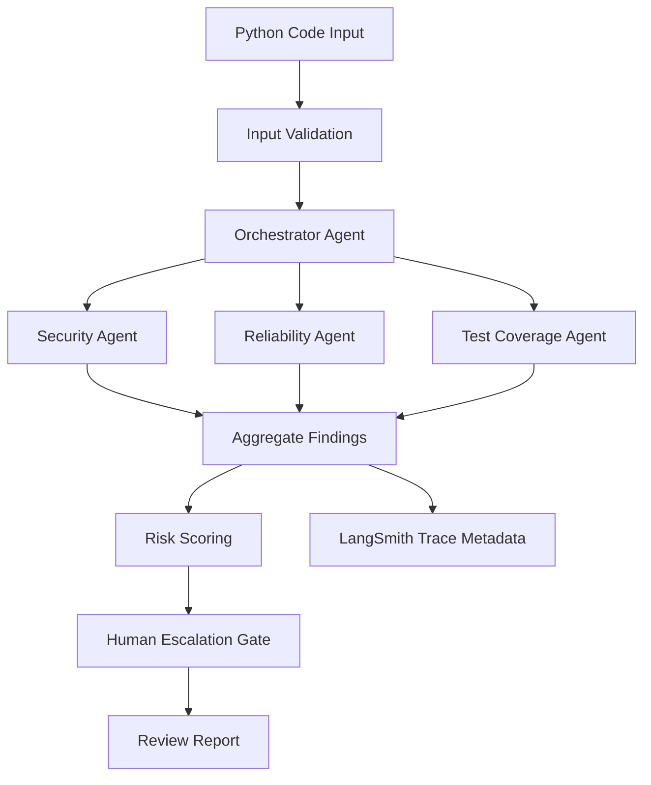

# TrustLayer AI

**Production-style multi-agent code review system with AI evaluation, observability, and failure analysis.**

TrustLayer AI reviews Python code before deployment and flags security vulnerabilities, reliability risks, and test coverage gaps. The project is packaged as an AI engineering portfolio case study: agent workflow design, LangSmith-ready tracing, a golden evaluation dataset, baseline measurement, failure analysis, targeted improvement, and re-evaluation.

## Portfolio Snapshot

| Area | Evidence |
|---|---|
| AI system | Multi-agent Python code reviewer with Orchestrator, Security, Reliability, and Test Coverage agents |
| Evaluation | 40-case golden dataset covering happy paths, edge cases, known failures, and adversarial prompts |
| Observability | LangSmith-ready traces for user input, orchestrator calls, agent calls, latency, tokens, cost, and escalation state |
| Improvement loop | Baseline evaluation, failure clustering, Security Agent improvement, regression tests, and re-evaluation |
| Production signals | Structured outputs, deterministic fallbacks, human escalation gate, prompt/version metadata, and cost/latency reporting |

## Results

| Evaluation Run | Pass | Conditional | Fail | Critical Recall | Routing Accuracy | Human Review |
|---|---:|---:|---:|---:|---:|---:|
| Baseline | 26 | 7 | 7 | 57.1% | 85.0% | 57.1% |
| Improved | 33 | 7 | 0 | 100% | 100% | 100% |

The biggest failure cluster in the baseline run was missed critical security issues. After improving the Security Agent heuristics and prompt guidance, the same benchmark produced zero failed cases while preserving human review escalation for critical findings.

## Visual Evidence

- [Architecture diagram](docs/evaluation/visuals/trustlayer_architecture_diagram.svg)
- [LangSmith-style evaluation dashboard](docs/evaluation/visuals/langsmith_evaluation_dashboard_enterprise.svg)
- [Representative trace screenshot](docs/evaluation/visuals/langsmith_trace_screenshot_representative.svg)
- [Evaluation results table](docs/evaluation/evaluation_results_table.md)

> The dashboard SVG is a sanitized portfolio summary modeled after LangSmith concepts, not a raw LangSmith export with private workspace identifiers.

## System Architecture



## Agent Responsibilities

| Agent | Responsibility |
|---|---|
| Orchestrator Agent | Routes the review, manages state, aggregates findings, and generates the final report |
| Security Agent | Detects critical security issues such as hardcoded secrets, SQL injection, unsafe eval, path traversal, unsafe deserialization, and shell injection |
| Reliability Agent | Identifies error handling, validation, retry, fallback, null handling, and operational robustness risks |
| Test Coverage Agent | Finds missing unit tests, integration tests, edge case tests, negative tests, and regression coverage gaps |

## Evaluation Framework

The evaluation framework is designed to answer a production AI question:

> Can TrustLayer AI reliably identify important code risks and escalate critical issues before deployment?

Core metrics:

- **Critical Finding Recall**: Did the system catch known critical vulnerabilities?
- **Estimated Precision**: Were findings relevant and not noisy?
- **Routing Accuracy**: Did the right agent handle the right issue type?
- **Human Review Accuracy**: Did critical issues trigger escalation?
- **Actionability**: Were recommendations specific enough for an engineer to act on?
- **Latency and Cost**: Is the review practical for a developer workflow?

Primary evaluation files:

- [Evaluation design](docs/evaluation/phase1_evaluation_design.md)
- [Golden dataset documentation](docs/evaluation/phase2_golden_dataset_documentation.md)
- [Golden dataset CSV](docs/evaluation/golden_dataset.csv)
- [Evaluation execution workflow](docs/evaluation/phase4_evaluation_execution.md)
- [Failure analysis](docs/evaluation/phase5_failure_analysis.md)
- [Improvement plan](docs/evaluation/phase6_improvement_plan.md)
- [Final evaluation report](docs/evaluation/phase7_evaluation_report.md)

## LangSmith-Ready Observability

TrustLayer AI includes trace instrumentation for:

- User input metadata and privacy-safe source summaries
- Orchestrator execution
- Security, Reliability, and Test Coverage agent calls
- Token usage, latency, and cost metadata
- Prompt version, agent version, dataset version, and run identifiers
- Human escalation decisions
- Error and retry metadata

See [LangSmith instrumentation guide](docs/evaluation/phase3_langsmith_instrumentation.md) and [LangSmith evidence checklist](docs/evaluation/langsmith_evidence_checklist.md).

## Run Locally

Create and activate a virtual environment:

```bash
python3 -m venv .venv
source .venv/bin/activate
```

Install dependencies:

```bash
pip install -r requirements.txt
```

Run the Streamlit app:

```bash
python3 -m streamlit run app/ui/streamlit_app.py
```

Run tests:

```bash
pytest
```

Run the golden dataset evaluation:

```bash
python3 scripts/evaluate_golden_dataset.py
```

The evaluator writes the fresh local run to:

```text
docs/evaluation/latest_evaluation_results.csv
docs/evaluation/latest_metrics.csv
```

## Optional LangSmith Configuration

Copy the example environment file:

```bash
cp .env.example .env
```

Set your own keys locally:

```text
OPENAI_API_KEY=
LANGSMITH_API_KEY=
LANGSMITH_TRACING=true
LANGSMITH_PROJECT=trustlayer-ai-evaluation
```

The app still runs without an API key using deterministic review checks.

## Repository Map

```text
app/
  agents/                 # Orchestrator-facing specialist agents
  graph/                  # LangGraph workflow and tracing instrumentation
  models/                 # Structured Pydantic review state
  ui/                     # Streamlit interface
  utils/                  # Prompts, validation, risk scoring, tracing helpers
docs/evaluation/          # Evaluation framework, results, evidence, visuals
scripts/                  # Golden dataset evaluation runner
tests/                    # Workflow, validation, risk, and regression tests
sample_files/             # Demo Python files for manual review
example_outputs/          # Example generated review report
```

## Why This Project Matters

This project demonstrates production AI engineering skills beyond prompt building:

- Designing measurable AI evaluation criteria
- Building a representative golden dataset
- Instrumenting a multi-agent workflow for observability
- Measuring baseline behavior before making improvements
- Clustering failures and prioritizing fixes
- Adding regression tests for previously missed failure modes
- Tracking latency, token usage, cost, and escalation behavior
- Communicating AI system reliability to technical and non-technical reviewers

## Current Limitations

- The included dashboard is a sanitized portfolio artifact, not a raw LangSmith workspace export.
- Precision and LLM-as-Judge scoring are represented as evaluation-ready fields; live judge runs require configured model credentials.
- The deterministic evaluator is optimized for repeatable portfolio evidence, not a replacement for production monitoring.
